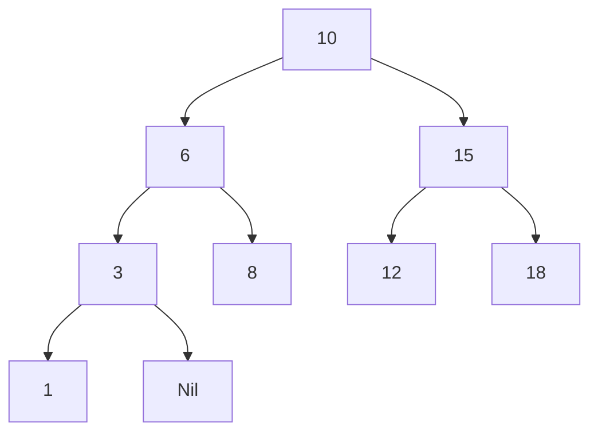
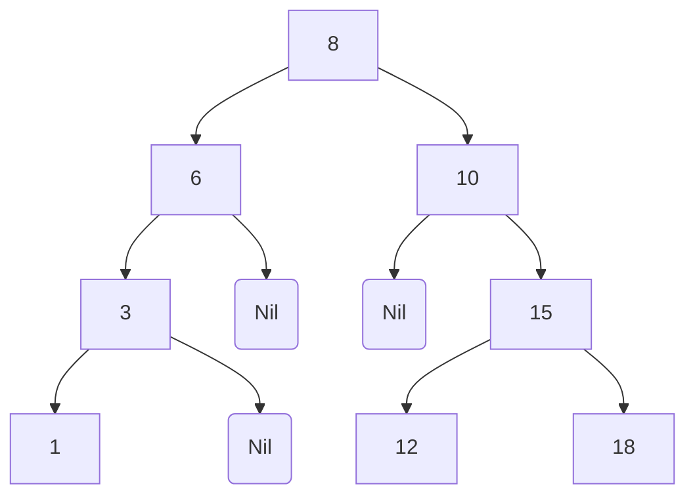

# 1. O que é?

É uma estrutura de dados de **árvore** de grau 2, baseada em nós, onde todos os nós da **subárvore esquerda** possuem um valor numérico **inferior** ao nó raiz e todos os nós da **subárvore direita** possuem um valor **superior** ao nó raiz.

Nesse tipo de árvore, **a ordem de inserção dos elementos importa**. Cada novo dado vai navegando na árvore (menores a esquerda e maiores a direita) até achar um ponto vazio para inserção.

Veja como fica a representação da árvore com a inserção dos elementos nesta ordem: 10, 6, 8, 15, 12, 18, 3, 1.



Veja que temos outra configuração para a inserção nesta ordem: 8, 6, 3, 1, 10, 15, 12, 18.



# 2. Problema

Nós vimos que para obter algoritmos eficientes, armazenamos os elementos ordenados e tiramos proveito dessa ordenação. Mas mesmo esses algoritmos mais eficientes de busca demandam esforço computacional **O(n)**.

Vimos também que a [Tabela Hash](http://www.jppreti.com/2019/07/29/tabela-hash/) permite realizar busca em tempo esperado **O(1)**.

O problema é que a tabela hash só funciona quando você conhece a **totalidade da chave** de busca. Por exemplo, você quer buscar alguém chamado *“João Paulo”*, mas não lembra o sobrenome, neste caso a tabela hash não poderia localizar o dado.

Outro problema da tabela hash é caso você queira retornar um conjunto de valores de um determinado **intervalo**, como por exemplo, retornar todos os dados que são menores que 10. A tabela hash funciona muito bem para buscas atômicas (um único resultado).

# 3. Vantagens

A árvore binária de busca é uma estrutura que permite manter os dados ordenados (facilita a busca por intervalos) e permite uma busca com esforço computacional **O(log** ***n*****)**. É como o algoritmo de busca binária para estruturas alocadas dinamicamente.

# 4. Biblioteca

Iremos criar uma biblioteca que suporte as seguintes operações:

- `add`: adiciona um novo elemento na árvore;
- `find`: localiza um elemento na árvore;
- `in_order`: exibe os elementos da árvore na ordem Esquerda Raiz Direita;
- `pre_order`: exibe os elementos da árvore na ordem Raiz Esquerda Direita;
- `post_order`: exibe os elementos da árvore na ordem Esquerda Direita Raiz;
- `removeTreeNode`: remove um elemento na árvore;
- `height`: retorna a altura da árvore;
- `destroy`: remove todos os elementos da árvore.

## 4.1. BinarySearchTree.h

```c
#ifndef BinarySearchTree_h
#define BinarySearchTree_h
#include <stdlib.h>
#include <stdio.h>

typedef struct TreeNode {
    void *element;
    struct TreeNode *left;
    struct TreeNode *right;
} TreeNode;

/*
- O usuário da biblioteca deve fornecer uma função para comparação dos elementos
*/

typedef int (*TreeComparator)(void *element1, void *element2);
/*
- O usuário da biblioteca deve fornecer uma função para impressão dos dados do TreeNode
*/

typedef void (*printNode)(void*);

/*
- Adiciona um novo elemento na árvore
*
- Argumentos: 
- - root: O endereço do ponteiro da raiz da árvore/subárvore
- - element: o elemento a ser adicionado
- - f: a função para comparação dos elementos
*
- Retorna:
- - 1 em caso de sucesso
- - 0 caso não tenha mais memória
- - -1 caso o elemento já exista na árvore
*/
int add(TreeNode **root, void *element, TreeComparator f);

/*
- Localiza um elemento na árvore
*
- Argumentos: 
- - root: A raiz da árvore/subárvore
- - key: o elemento a ser localizado
- - f: a função para comparação dos elementos
- - element: um parâmetro de saída
*
- Retorna: 
- - 1 em caso de sucesso
- - 0 caso não encontre
*/
int find(TreeNode *root, void *key, TreeComparator f, void **element);

/*
- Imprime os elementos na ordem Esquerda Raiz Direita
*/
void in_order(TreeNode *root, printNode print);

/*
- Imprime os elementos Raiz Esquerda Direita
*/
void pre_order(TreeNode *root, printNode print);

/*
- Imprime os elementos Esquerda Direita Raiz
*/
void post_order(TreeNode *root, printNode print);

/*
- Remove um elemento na árvore
*
- Argumentos: 
- - root: A raiz da árvore/subárvore
- - key: o elemento a ser localizado e removido
- - f: a função para comparação dos elementos
*
- Retorna: 
- - 1 em caso de sucesso
- - 0 caso não encontre
*/
int removeTreeNode(TreeNode **root, void *key, TreeComparator f);

/*
- Calcula a altura da árvore/subárvore
*
- Argumentos: 
- - root: A raiz da árvore/subárvore
*
- Retorna: 
- - inteiro que representa a altura da árvore
- - árvore com apenas um nó tem altura 0
*/
int height (TreeNode *root);

/*
- Destrói a árvore/subárvore
*
- Argumentos: 
- - root: A raiz da árvore/subárvore
*/
void destroy (TreeNode **root);

#endif
```

## 4.2. Implementação

### 4.2.1. add

Vamos começar pela adição, observando a assinatura da função:

`int add(TreeNode **root, void *element, TreeComparator f)`

Perceba que temos 3 parâmetros:

- `root`: do tipo TreeNode, representa a raiz da árvore ou subárvore. Perceba o [ponteiro duplo](http://www.jppreti.com/2019/07/15/ponteiro-duplo-em-c/) que será necessário para atualizarmos o nó pai;
- `element`: representa o endereço de memória do dado que será guardado na árvore;
- `f`: ponteiro para a função com o algoritmo de comparação. Este deve ser construído e informado pelo usuário da nossa biblioteca.

Esta função foi implementada utilizando recursividade e em um primeiro momento iremos navegar até encontrar um nó folha. A rotina básica consiste em navegar à direita e à esquerda até encontrar `NULL`.

A primeira verificação é se `*root == NULL`, sendo verdadeira quer dizer que alcançamos alguma extremidade da árvore.

`if ((*root) == NULL)`

Podemos então alocar a memória para um novo nó (`TreeNode`) e inicializar a sua estrutura com o dado que está sendo adicionado e inicializando os ponteiros com `NULL` (novo nó é um nó folha).

```c
// Alocamos a memória para um novo nó
TreeNode *newnode = (TreeNode *) malloc(sizeof(TreeNode));
// Se não houver memória disponível retornamos 0 (não foi possível inserir)
if (newnode == NULL)
    return 0;
// guardamos o dado que está sendo inserido
newnode->element = element;
// inicializamos os ponteiros com NULL por ser nó folha
newnode->left = newnode->right = NULL;
// variável que estava apontando para NULL é atualizada com o novo endereço alocado
*root = newnode;
// retornamos a quantidade inserida
return 1;
```

Esse primeiro teste representa a nossa condição de parada da recursividade. Agora podemos implementar a navegação recursiva.

Antes disso precisamos saber se o dado que será inserido deverá ficar a esquerda ou a direita na árvore. Para isso criamos uma variável `compvalue` que recebe o resultado da função apontada por `f`:

int compvalue = f(element, (*root)->element);

Perceba que a função `f` compara o dado que será inserido (`element`) com o dado presente no nó analisado (`*root->element`).

Não precisamos conhecer a implementação de `f`, apenas sabemos que a função irá retornar **-1** se o valor é menor, **0** se os dois valores são iguais ou **+1** se o valor é maior.

Se `compvalue` for **positivo** então devemos navegar **à direita**, se for **menor** devemos navegar à **equerda** na árvore e caso seja **igual** retornamos **-1**, informando que não foi possível adicionar o dado porque ele **já existe** na árvore.

```c
if (compvalue > 0) {
    return add(&(*root)->right, element, f);
} else if (compvalue < 0) {
    return add(&(*root)->left, element, f);
} else {
    return -1;
}
```

Veja que estamos navegando na árvore de forma **recursiva**, o novo nó raiz (`root`) passa a ser a subárvore da esquerda ou da direita. A implementação completa de `add` pode ser visualizada abaixo:

```c
int add(TreeNode **root, void *element, TreeComparator f) {
    if ((*root) == NULL) {
    // alcançou o local da folha, atualiza o pai
        TreeNode *newnode = (TreeNode *) malloc(sizeof(TreeNode));
        if (newnode == NULL)
            return 0;
        newnode->element = element;
        newnode->left = newnode->right = NULL;
        *root = newnode;
        return 1;
    }
    int compvalue = f(element, (*root)->element);
    if (compvalue > 0) {
        return add(&(*root)->right, element, f);
    } else if (compvalue < 0) {
        return add(&(*root)->left, element, f);
    } else {
        return -1;
    }
}
```

### 4.2.2. find

Esta função tem por finalidade localizar um dado na árvore. Vejamos a assinatura da função:

`int find(TreeNode *root, void *key, TreeComparator f, void **element)`

Veja que temos 4 parâmetros:

- `root`: raiz da árvore/subárvore;
- `key`: chave de busca;
- `f`: ponteiro para a função de comparação;
- `element`: [ponteiro duplo](http://www.jppreti.com/2019/07/15/ponteiro-duplo-em-c/) para guardar na variável ponteiro passada como parâmetro o endereço do elemento encontrado.

Primeiro verificamos se passamos de alguma folha, porque se for o caso quer dizer que a chave não foi encontrada na árvore, retornando zero (`0`) elemento encontrado.

```c
// Passamos a folha
if (root == NULL)
    return 0;
```

Se não passamos de um nó folha então podemos comparar se a chave encontra-se no nó atual. Para isso chamamos a função de comparação (`f`) e verificamos se o retorno é igual a zero (`0`), ou seja, foi encontrado.

```c
int compvalue = f(key, root->element);
if (compvalue == 0) {
    // encontrado
    *element = root->element;
    return 1; //1 elemento encontrado
}
```

Caso o elemento não seja o que estamos procurando precisamos saber se devemos navegar a esquerda ou a direita na árvore .

```c
// desce no nível da árvore
if (compvalue > 0)
    return find(root->right, key, f, element);
return find(root->left, key, f, element);
```


Perceba que vamos navegando recursivamente na subárvore direita (`compvalue > 0`) ou equerda (`compvalue < 0`). Abaixo podemos ver a implementação completa de `find`.

```c
int find(TreeNode *root, void *key, TreeComparator f, void **element) {
    // Passamos a folha
    if (root == NULL)
        return 0;
    int compvalue = f(key, root->element);
    if (compvalue == 0) {
        // encontrado
        *element = root->element;
        return 1;
    }
    // desce no nível da árvore
    if (compvalue > 0)
        return find(root->right, key, f, element);
    return find(root->left, key, f, element);
}
```

### 4.2.2. in_order

```c
void in_order(TreeNode *root, printNode print) {
    if (root!=NULL) {
        in_order(root->left, print);
        print(root->element);
        in_order(root->right, print);
    }
}
```

### 4.2.3. pre_order

```c
void pre_order(TreeNode *root, printNode print) {
    if (root!=NULL) {
        print(root->element);
        pre_order(root->left, print);
        pre_order(root->right, print);
    }
}
```

### 4.2.4. post_order

```c
void post_order(TreeNode *root, printNode print) {
    if (root!=NULL) {
        post_order(root->left, print);
        post_order(root->right, print);
        print(root->element);
    }
}
```

### 4.2.5. greaterRight

```c
TreeNode *greaterRight(TreeNode **no){
    if((*no)->right != NULL)
        return greaterRight(&(*no)->right);
    else{
        TreeNode *aux = *no;
        // se nao houver essa verificacao, esse nó vai perder todos os seus filhos da esquerda!
        if((*no)->left != NULL)
            *no = (*no)->left;
        else
            *no = NULL;
        return aux;
    }
}
```

### 4.2.6. smallerLeft

```c
TreeNode *smallerLeft(TreeNode **no){
    if((*no)->left != NULL)
        return smallerLeft(&(*no)->left);
    else{
        TreeNode *aux = *no;
        // se nao houver essa verificacao, esse nó vai perder todos os seus filhos da direita!
        if((*no)->right != NULL)
            *no = (*no)->right;
        else
            *no = NULL;
        return aux;
    }
}
```

### 4.2.7. removeTreeNode

```c
int removeTreeNode(TreeNode **root, void *key, TreeComparator f) {
    if(*root == NULL){ // caso a chave nao exista na arvore
        return 0;
    }
    int compvalue = f(key, (*root)->element);
    if(compvalue < 0)
        removeTreeNode(&(*root)->left, key, f);
    else {
        if(compvalue > 0) {
            removeTreeNode(&(*root)->right, key, f);
        } else { // se nao eh igual
            TreeNode *aux = *root;
            // Se nao tem filhos
            if (((*root)->left == NULL) && ((*root)->right == NULL)){
                free(aux);
                (*root) = NULL;
            } else { // so tem o filho da direita
                if ((*root)->left == NULL){
                    (*root) = (*root)->right;
                    aux->right = NULL;
                    free(aux); aux = NULL;
                } else { //so tem filho da esquerda
                    if ((*root)->right == NULL){
                        (*root) = (*root)->left;
                        aux->left = NULL;
                        free(aux); aux = NULL;
                    } else { //Busco o maior filho à direita da subarvore esquerda.
                        aux = greaterRight(&(*root)->left);
                        aux->left = (*root)->left;
                        aux->right = (*root)->right;
                        (*root)->left = (*root)->right = NULL;
                        free((*root)); *root = aux; aux = NULL;
                    }
                }
            }
        }
    }
    return 1;
}
```

### 4.2.8. height

```c
int height (TreeNode *root) {
    if (root == NULL)
        return -1; // altura da árvore vazia
    else {
        int hl = height(root->left); //altura esquerda
        int hr = height(root->right); //altura direita
        if (hl < hr) return hr + 1;
        else return hl + 1;
    }
}
```

### 4.2.9. destroy

```c
//navegar em pos-ordem
void destroy (TreeNode **root) {
    if (*root==NULL) return;
    destroy(&(*root)->left);
    destroy(&(*root)->right);
    free(*root);
    *root=NULL;
}
```

Abaixo podemos ver a implementação completa de `BinarySearchTree.c`:

## 4.3. BinarySearchTree.c

```c
#include "BinarySearchTree.h"

int add(TreeNode **root, void *element, TreeComparator f) {
    if ((*root) == NULL) {
        // alcançou o local da folha, atualiza o pai
        TreeNode *newnode = (TreeNode *) malloc(sizeof(TreeNode));
        if (newnode == NULL)
            return 0;
        newnode->element = element;
        newnode->left = newnode->right = NULL;
        *root = newnode;
        return 1;
    }
    int compvalue = f(element, (*root)->element);
    if (compvalue > 0) {
        return add(&(*root)->right, element, f);
    } else if (compvalue < 0) {
        return add(&(*root)->left, element, f);
    } else {
        return -1;
    }
}

int find(TreeNode *root, void *key, TreeComparator f, void **element) {
    int compvalue;
    // Passamos a folha
    if (root == NULL)
        return 0;
    compvalue = f(key, root->element);
    if (compvalue == 0) {
        // encontrado
        *element = root->element;
        return 1;
    }
    // desce no nível da árvore
    if (compvalue > 0)
        return find(root->right, key, f, element);
    return find(root->left, key, f, element);
}

void in_order(TreeNode *root, printNode print) {
    if (root!=NULL) {
        in_order(root->left, print);
        print(root->element);
        in_order(root->right, print);
    }
}

void pre_order(TreeNode *root, printNode print) {
    if (root!=NULL) {
        print(root->element);
        pre_order(root->left, print);
        pre_order(root->right, print);
    }
}

void post_order(TreeNode *root, printNode print) {
    if (root!=NULL) {
        post_order(root->left, print);
        post_order(root->right, print);
        print(root->element);
    }
}

TreeNode *greaterRight(TreeNode **no){
    if((*no)->right != NULL)
        return greaterRight(&(*no)->right);
    else{
        TreeNode *aux = *no;
        if((*no)->left != NULL) // se nao houver essa verificacao, esse nó vai perder todos os seus filhos da esquerda!
            *no = (*no)->left;
        else
            *no = NULL;
        return aux;
    }
}

TreeNode *smallerLeft(TreeNode **no){
    if((*no)->left != NULL)
        return smallerLeft(&(*no)->left);
    else{
        TreeNode *aux = *no;
        if((*no)->right != NULL) // se nao houver essa verificacao, esse nó vai perder todos os seus filhos da direita!
            *no = (*no)->right;
        else
            *no = NULL;
        return aux;
    }
}

int removeTreeNode(TreeNode **root, void *key, TreeComparator f) {
    if(*root == NULL){ // caso a chave nao exista na arvore
        return 0;
    }
    int compvalue = f(key, (*root)->element);
    if(compvalue < 0)
        removeTreeNode(&(*root)->left, key, f);
    else {
        if(compvalue > 0) {
            removeTreeNode(&(*root)->right, key, f);
        } else { // se nao eh igual
            TreeNode *aux = *root;
            // Se nao tem filhos
            if (((*root)->left == NULL) && ((*root)->right == NULL)){
                free(aux);
                (*root) = NULL;
            } else { // so tem o filho da direita
                if ((*root)->left == NULL){
                    (*root) = (*root)->right;
                    aux->right = NULL;
                    free(aux); aux = NULL;
                } else { //so tem filho da esquerda
                    if ((*root)->right == NULL){
                        (*root) = (*root)->left;
                        aux->left = NULL;
                        free(aux); aux = NULL;
                    } else { //Busco o maior filho à direita da subarvore esquerda.
                        aux = greaterRight(&(*root)->left);
                        aux->left = (*root)->left;
                        aux->right = (*root)->right;
                        (*root)->left = (*root)->right = NULL;
                        free((*root)); *root = aux; aux = NULL;
                    }
                }
            }
        }
    }
    return 1;
}

int height (TreeNode *root) {
    if (root == NULL)
        return -1; // altura da árvore vazia
    else {
        int hl = height(root->left); //altura esquerda
        int hr = height(root->right); //altura direita
        if (hl < hr) return hr + 1;
        else return hl + 1;
    }
}

//navegar em pos-ordem
void destroy (TreeNode **root) {
    if (*root==NULL) return;
    destroy(&(*root)->left);
    destroy(&(*root)->right);
    free(*root);
    *root=NULL;
}
```

## 4.4. BinarySearchTreeTest.c

```c
#include <assert.h>
#include <string.h>
#include "BinarySearchTree.h"

//Elemento que será guardado na árvore
typedef struct BinarySearchTreeElement {
    int key;
    char value[10];
} BinarySearchTreeElement;

// Função para comparação dos elementos
static int BinarySearchTreeElementComparator(void *element1, void *element2) {
    BinarySearchTreeElement *e1 = (BinarySearchTreeElement *) element1;
    BinarySearchTreeElement *e2 = (BinarySearchTreeElement *) element2;

    if (e1->key > e2->key)
        return 1;

    if (e1->key < e2->key)
        return -1;

return 0;
}

void printInteger(void *data) {
    BinarySearchTreeElement *bste = (BinarySearchTreeElement*)data;
    printf("%d ", bste->key);
}

int main(int argc, char **argv) {
    TreeNode *tree = NULL;
    BinarySearchTreeElement *el, findEl;
    // Adiciona alguns elementos
    el = (BinarySearchTreeElement *) malloc(sizeof(BinarySearchTreeElement));
    assert(el != NULL);
    el->key = 45;
    snprintf(el->value, 10, "Val 45");
    assert(add(&tree, el, &BinarySearchTreeElementComparator) == 1);
    assert(add(&tree, el, &BinarySearchTreeElementComparator) == -1);
    el = (BinarySearchTreeElement *) malloc(sizeof(BinarySearchTreeElement));
    assert(el != NULL);
    el->key = 60;
    snprintf(el->value, 10, "Val 60");
    assert(add(&tree, el, &BinarySearchTreeElementComparator) == 1);
    assert(add(&tree, el, &BinarySearchTreeElementComparator) == -1);
    el = (BinarySearchTreeElement *) malloc(sizeof(BinarySearchTreeElement));
    assert(el != NULL);
    el->key = 50;
    snprintf(el->value, 10, "Val 50");
    assert(add(&tree, el, &BinarySearchTreeElementComparator) == 1);
    assert(add(&tree, el, &BinarySearchTreeElementComparator) == -1);
    el = (BinarySearchTreeElement *) malloc(sizeof(BinarySearchTreeElement));
    assert(el != NULL);
    el->key = 53;
    snprintf(el->value, 10, "Val 53");
    assert(add(&tree, el, &BinarySearchTreeElementComparator) == 1);
    assert(add(&tree, el, &BinarySearchTreeElementComparator) == -1);
    el = (BinarySearchTreeElement *) malloc(sizeof(BinarySearchTreeElement));
    assert(el != NULL);
    el->key = 55;
    snprintf(el->value, 10, "Val 55");
    assert(add(&tree, el, &BinarySearchTreeElementComparator) == 1);
    assert(add(&tree, el, &BinarySearchTreeElementComparator) == -1);
    el = (BinarySearchTreeElement *) malloc(sizeof(BinarySearchTreeElement));
    assert(el != NULL);
    el->key = 48;
    snprintf(el->value, 10, "Val 48");
    assert(add(tree, el, &BinarySearchTreeElementComparator, &tree) == 1);
    assert(add(tree, el, &BinarySearchTreeElementComparator, &tree) == -1);
    findEl.key = 50;
    assert(find(tree, (void *) &findEl, &BinarySearchTreeElementComparator,
        (void **) &el) == 1);
    assert(strcmp(el->value, "Val 50") == 0);
    findEl.key = 53;
    assert(find(tree, &findEl, &BinarySearchTreeElementComparator,
        (void **) &el) == 1);
    assert(strcmp(el->value, "Val 53") == 0);
    findEl.key = 45;
    assert(find(tree, &findEl, &BinarySearchTreeElementComparator,
        (void **) &el) == 1);
    assert(strcmp(el->value, "Val 45") == 0);
    findEl.key = 60;
    assert(find(tree, &findEl, &BinarySearchTreeElementComparator,
        (void **) &el) == 1);
    assert(strcmp(el->value, "Val 60") == 0);
    // Tentativa que não encontra na árvore
    findEl.key = 10;
    assert(find(tree, &findEl, &BinarySearchTreeElementComparator,
        (void **) &el) == 0);
    el = (BinarySearchTreeElement *) malloc(sizeof(BinarySearchTreeElement));
    el->key=45;
    removeTreeNode(&tree, el, &BinarySearchTreeElementComparator);
    in_order(tree, printInteger);
    printf("\n");
    pre_order(tree, printInteger);
    printf("\n");
    post_order(tree, printInteger);
    printf("\n");
    printf("Altura: %d ", height(tree));
    printf("\n");
    destroy(&tree);
    in_order(tree, printInteger);
    assert(tree == NULL);
    printf("\n");
    return 0;
}
```
