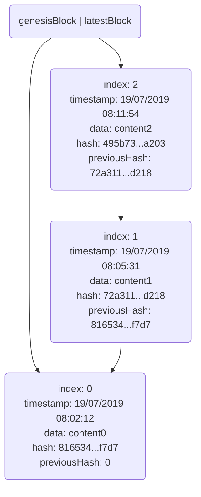

# 1. O que é?

Trata-se de uma **lista ligada** em que é possível verificar a **integridade**, ou seja, é possível identificar se a lista permanece inalterada ao longo do tempo.

O conceito de lista ligada nós vimos no artigo [Lista Simplesmente Ligada](http://www.jppreti.com/2019/07/15/lista-simplesmente-ligada/).

Nós também vimos no artigo sobre [Tabela Hash](http://www.jppreti.com/2019/07/29/tabela-hash/) que o hash pode ser utilizado para agilizar busca, mas vamos descobrir que também é útil em criptografia, assista o vídeo abaixo **até o tempo 24m:50s** que é suficiente para o entendimento deste artigo:

Prof. Edward W. Felten (Princeton University)

Uma função hash criptográfica permite verificar facilmente a integridade de dados transmitidos, tendo em vista que qualquer alteração no dado implicaria em uma mudança no hash.

O conceito básico é bastante simples: um banco de dados distribuído que mantém uma lista de registros ordenados que cresce continuamente.

A complexidade conhecida das *blockchains* está relacionada aos problemas que se tenta resolver com ela: como o Bitcoin. O termo *blockchain* está normalmente relacionado a conceitos como transações, contratos ou criptomoedas.

Esses outros conceitos é que tornam a compreensão dessa estrutura de dados mais difícil do que deveria ser.

Vamos implementar uma *blockchain* em C como exemplo.

# 2. Estrutura

## 2.1. Estrutura do Bloco

O primeiro passo é definir a estrutura do bloco que estará presente em nossa lista. Vamos mantê-la bastante simples para fins de compreensão, composta por:

- `index`: código único sequencial de identificação do bloco;
- `timestamp`: registro da data e hora em que o bloco foi criado;
- `data`: conteúdo armazenado no bloco. Em uma criptomoeda poderia ser o valor da moeda;
- `hash`: identificação de comprimento fixo que garante a integridade dos dados do bloco;
- `previous hash`: hash do bloco anterior.

A estrutura definida em C é apresentada conforme segue:

```c
typedef struct Block {
    unsigned int index;
    char* previousHash;
    struct Block* previousBlock;
    unsigned long timestamp;
    float data;
    char* hash;
}Block;
```

Nossa lista simplesmente ligada deverá se parecer com a figura abaixo:



O hash do bloco anterior precisa estar no bloco para manter a integridade da lista

Criaremos uma estrutura para guardar um bloco especial (genesisBlock) e uma referência do último bloco.

```c
typedef struct Blockchain {
    Block *genesisBlock; //ponteiro para o primeiro bloco
    Block *latestBlock; //ponteiro para o último bloco
}Blockchain;
```

Diferentemente da lista simplesmente ligada aonde guardávamos uma referência do primeiro elemento, na blockchain precisamos do último. Perceba na imagem que é o bloco 2 que conhece o bloco 1 e assim sucessivamente até chegar ao bloco 0 (genesisBlock).

Segue nosso arquivo Blockchain.h:

## 2.2. Blockchain.h

```c
#ifndef Blockchain_h
#define Blockchain_h
#include <stdlib.h>
#include <stdio.h>
#include <stdbool.h>

typedef struct Block {
    unsigned int index;
    char* previousHash;
    struct Block* previousBlock;
    unsigned long timestamp;
    float data;
    char* hash;
}Block;

typedef struct Blockchain {
    Block *genesisBlock;
    Block *latestBlock;
}Blockchain;

void initBlockchain(Blockchain *blockchain);
char* calculateHash(int index, char* previousHash, unsigned long timestamp, float data);
Block* generateNextBlock(Blockchain *blockchain, float data);
Block* getLatestBlock(Blockchain *blockchain);
bool isValidNewBlock(Block* newBlock, Block* previousBlock);
bool isBlockchainValid(Blockchain *blockchain);
int addBlock(Blockchain *blockchain, Block *newBlock);

#endif
```

# 3. Implementação

## 3.1. Calculando o Hash do Bloco

Precisamos calcular o hash do bloco para manter a integridade dos dados. Utilizaremos um algoritmo SHA-256 sobre o conteúdo do bloco. Este cálculo de hash nada tem haver com a atividade de mineração (*mining*), visto que, não implementaremos o conceito de *Proof of Work*.

Primeiro vamos criar um procedimento para transformar um hash de 32 bytes (256 bits) em uma string de 64 caracteres:

```c
static void hash_to_string(char string[65], const uint8_t hash[32])
{
    size_t i;
    //montar uma string com 64 caracteres hexadecimais
    for (i = 0; i < 32; i++) {
        //02x hexadecimal em 2 caracteres
        string += sprintf(string, "%02x", hash[i]);
    }
}
```

Agora podemos implementar a função que irá invocar a função SHA-256 para transformar os dados de comprimento variável para dados de comprimento fixo e retornar como texto de 64 caracteres:

```c
char* calculateHash(int index, char* previousHash, unsigned long timestamp, float data) {
    char input[1024];
    sprintf(input, "%i%s%lu%.8f",index,previousHash, timestamp, data);
    uint8_t hash[32]; //vetor de 32 bytes de inteiros unsigned [0-255] (256/8 = 32)
    //char hash_string[65];
    char *hash_string = (char*)malloc(sizeof(char)*65);
    //realiza a função hash
    calc_sha_256(hash, input, strlen(input));
    //transforma o hash em uma string de 64 caracteres
    hash_to_string(hash_string, hash);
    return hash_string;
}
```

A biblioteca SHA-256 pode ser baixada [aqui](https://raw.githubusercontent.com/jppreti/EstruturaDadosC/master/datastructure/sha-256.c).

## 3.2. Gerando um Bloco

Para gerar um bloco precisamos conhecer o hash do bloco anterior e criar o restante (*index*, *hash*, *data* e *timestamp*). O *data* é fornecido pelo usuário.

```c
Block* generateNextBlock(Blockchain *blockchain, float data) {
    //pegamos uma referência ao último bloco da lista
    Block *previousBlock = getLatestBlock(blockchain);
    Block *newBlock = (Block*)malloc(sizeof(Block));
    newBlock->data = data;
    newBlock->previousHash = previousBlock->hash;
    newBlock->index = previousBlock->index+1;
    //pegamos a data e hora atual
    newBlock->timestamp = time(NULL);
    //calculamos o hash do novo bloco
    newBlock->hash = calculateBlockHash(newBlock);
    return newBlock;
}
```

## 3.3. Armazenando os Blocos

Vamos armazenar os blocos na memória principal por meio de uma [Lista Simplesmente Ligada](http://www.jppreti.com/2019/07/15/lista-simplesmente-ligada/). O primeiro bloco da blockchain é chamado de **genesis-block**, que será codificado diretamente no algoritmo de inicialização da estrutura.

```c
void initBlockchain(Blockchain *blockchain) {
    Block *genesisBlock = (Block*)malloc(sizeof(Block));
    genesisBlock->index = 0;
    genesisBlock->previousHash = "0";
    genesisBlock->previousBlock = NULL;
    genesisBlock->timestamp = time(NULL);
    genesisBlock->data = 1000000;
    //calcula o hash do genesis block
    genesisBlock->hash = calculateHash(genesisBlock->index, genesisBlock->previousHash, genesisBlock->timestamp, genesisBlock->data);
    blockchain->genesisBlock = genesisBlock;
    blockchain->latestBlock = genesisBlock;
}
```

## 3.4. Validando a Integridade da Blockchain

Primeiro implementamos o algoritmo de validação da integridade de um único bloco:

```c
bool isValidNewBlock(Block* newBlock, Block* previousBlock) {

if (previousBlock->index + 1 != newBlock->index) {

return false;

} else if (previousBlock->hash != newBlock->previousHash) {

return false;

} else if (strcmp(calculateBlockHash(newBlock),newBlock->hash)!=0) {

return false;

}

return true;

}
```

Agora podemos implementar o algoritmo de validação da integridade da cadeia como um todo:

```c
bool isBlockchainValid(Blockchain *blockchain) {

Block *aux = getLatestBlock(blockchain);

while (aux!=blockchain->genesisBlock) {

if (!isValidNewBlock(aux, aux->previousBlock))

return false;

aux = aux->previousBlock;

}

return true;

}
```

Segue a implementação completa de Blockchain.c.

## 3.5. Blockchain.c

```c
#include "Blockchain.h"
#include <string.h>
#include "sha-256.h"
#include <time.h>

void initBlockchain(Blockchain *blockchain) {
    Block *genesisBlock = (Block*)malloc(sizeof(Block));
    genesisBlock->index = 0;
    genesisBlock->previousHash = "0";
    genesisBlock->previousBlock = NULL;
    genesisBlock->timestamp = time(NULL);
    genesisBlock->data = 1000000;
    genesisBlock->hash = calculateHash(genesisBlock->index, genesisBlock->previousHash, genesisBlock->timestamp, genesisBlock->data);
    blockchain->genesisBlock = genesisBlock;
    blockchain->latestBlock = genesisBlock;
}

static void hash_to_string(char string[65], const uint8_t hash[32]) {
    size_t i;
    for (i = 0; i < 32; i++) {
        //montar uma string com 64 caracteres hexadecimais
        string += sprintf(string, "%02x", hash[i]); //02x hexadecimal em 2 caracteres
    }
}

char* calculateHash(int index, char* previousHash, unsigned long timestamp, float data) {
    char input[1024];
    sprintf(input, "%i%s%lu%.8f",index,previousHash, timestamp, data);
    //vetor de 32 bytes de inteiros unsigned [0-255] (256/8 = 32)
    uint8_t hash[32];
    //char hash_string[65];
    char *hash_string = (char*)malloc(sizeof(char)*65);
    calc_sha_256(hash, input, strlen(input));
    hash_to_string(hash_string, hash);
    return hash_string;
}

char* calculateBlockHash(Block *block) {
    return calculateHash(block->index, block->previousHash, block->timestamp, block->data);
}

Block* generateNextBlock(Blockchain *blockchain, float data) {
    Block *previousBlock = getLatestBlock(blockchain);
    Block *newBlock = (Block*)malloc(sizeof(Block));
    newBlock->data = data;
    newBlock->previousHash = previousBlock->hash;
    newBlock->index = previousBlock->index+1;
    newBlock->timestamp = time(NULL);
    newBlock->hash = calculateBlockHash(newBlock);
    return newBlock;
}

Block* getLatestBlock(Blockchain *blockchain) {
    return blockchain->latestBlock;
}

bool isValidNewBlock(Block* newBlock, Block* previousBlock) {
    if (previousBlock->index + 1 != newBlock->index) {
        return false;
    } else if (previousBlock->hash != newBlock->previousHash) {
        return false;
    } else if (strcmp(calculateBlockHash(newBlock),newBlock->hash)!=0) {
        return false;
    }
    return true;
}

bool isBlockchainValid(Blockchain *blockchain) {
    Block *aux = getLatestBlock(blockchain);
    while (aux!=blockchain->genesisBlock) {
        if (!isValidNewBlock(aux, aux->previousBlock))
            return false;
        aux = aux->previousBlock;
    }
    return true;
}

int addBlock(Blockchain *blockchain, Block *newBlock) {
    if (isValidNewBlock(newBlock, getLatestBlock(blockchain))) {
        newBlock->previousBlock = getLatestBlock(blockchain);
        blockchain->latestBlock = newBlock;
        return 1;
    }
    return -1;
}
```

## 3.6. BlockchainTest.c

```c
#include "Blockchain.h"

int main() {
    Blockchain blockchain;
    printf("");
    initBlockchain(&blockchain);
    printf("%s\n",blockchain.genesisBlock->hash);
    printf("%lu\n",blockchain.genesisBlock->timestamp);
    Block *newBlock2 = generateNextBlock(&blockchain,80.0);
    addBlock(&blockchain, newBlock2);
    Block *newBlock3 = generateNextBlock(&blockchain,250.0);
    addBlock(&blockchain, newBlock3);
    printf("Block 2 is valid? %i\n",isValidNewBlock(newBlock2, blockchain.genesisBlock));
    newBlock2->data = 74.00;
    printf("Blockchain is valid? %i\n",isBlockchainValid(&blockchain));
    printf("size: %u\n",blockchain.latestBlock->index);
    return 0;
}
```


