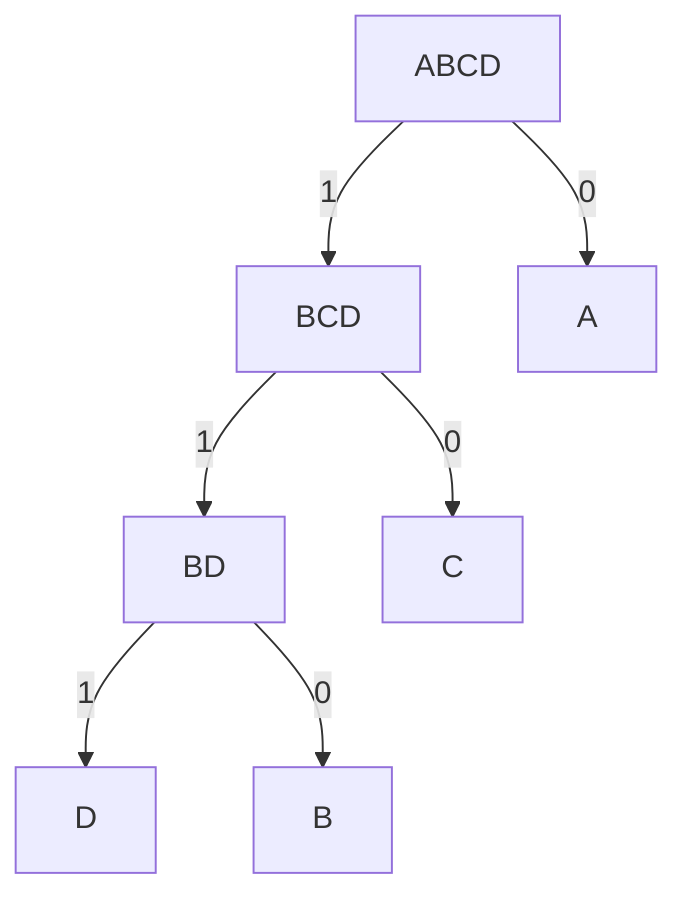
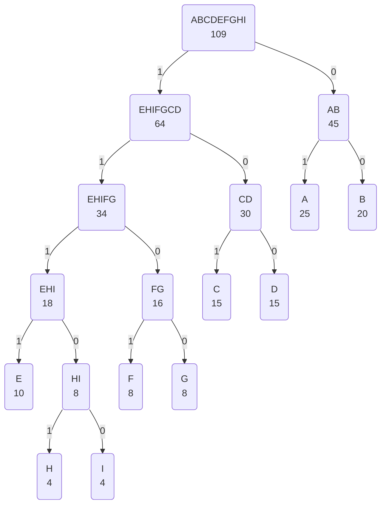

# 1. Introdução

O conceito de árvore pode ser utilizado não só para otimização da busca, mas também podemos tirar proveito dessa estrutura para nos auxiliar na **compressão de dados**.

É possível utilizar uma árvore de grau 2 para organizarmos a estrutura binária do código dos símbolos mais utilizados. Nessa estratégia podemos ter um tamanho variável para representar os símbolos.

Mas como vamos conseguir ler esses bits se o tamanho é variável?

Basta que o prefixo de um símbolo não possa mais ser utilizado na codificação de outro símbolo, dessa forma não teremos dúvida. Estamos falando aqui da **codificação de Huffman**.

A codificação de Huffman é utilizada para compressão de arquivos, principalmente texto.

## 1.2. Exemplo

Tomemos como exemplo um texto em que as letras A e C são mais frequentes que B e D. Poderíamos então ter uma tabela de codificação conforme segue:

| **Símbolo** | **Código** |
| ----------- | ---------- |
| A           | 0          |
| B           | 110        |
| C           | 10         |
| D           | 111        |

Neste caso a palavra ACABA teria a seguinte a seguinte representação binária:

| A   | C   | A   | B   | A   |
| --- | --- | --- | --- | --- |
| 0   | 10  | 0   | 110 | 0   |

Perceba que teríamos apenas 8 bits (1 byte) para representar a palavra ACABA ao invés de 40 bits (8 bytes) no formato convencional da tabela ASCII.

# 2. Requisito

O código de um símbolo não pode ser prefixo de um outro código. Se isso ocorrer teremos uma ambiguidade na decodificação.

### Exemplo

Imagine a seguinte tabela de codificação:

| **Símbolo** | **Huffman** |
| ----------- | ----------- |
| A           | 0           |
| B           | 01          |
| C           | 1           |

Se pegarmos a nossa mesma palavra anterior ACABA, ela teria a seguinte codificação binária:

| A     | C     | A   | B   | A   |
| ----- | ----- | --- | --- | --- |
| **0** | **1** | 0   | 01  | 0   |

Os primeiros 2 bits em negrito (01) são A e C ou B? Perceba que o código de A é prefixo de B e isso gera uma ambiguidade que não pode ocorrer para que possamos realizar a decodificação de forma adequada.

# 3. Problema

Dada uma tabela de frequências, como determinar o melhor conjunto de códigos, ou seja, o conjunto que irá realizar a melhor compressão para os símbolos do texto?

O algoritmo de Huffman produz a tabela de codificação baseada na **frequência dos símbolos**.

Contabiliza-se primeiro a quantidade utilizada de cada símbolo e atribuí-se códigos (bits) menores para símbolos mais frequentes e códigos maiores para símbolos menos frequentes.

### Idéia Básica

Construir uma árvore binária tal que:

- As suas folhas sejam os N símbolos do alfabeto;
- Cada ramo da árvore seja um valor 1 (esquerda) ou 0 (direita);
- O código de um símbolo será a sequência de bits dos ramos da raiz até a sua posição na árvore.

### Exemplo

| **Símbolo** | **Huffman** |
| ----------- | ----------- |
| A           | 0           |
| B           | 110         |
| C           | 10          |
| D           | 111         |

Perceba que vamos agrupando os símbolos de menor quantidade até que tenhamos agrupado todos os símbolos.

Ao final teremos um nó raiz que contém todos os símbolos do texto, esses símbolos representam um índice para navegar em nossa estrutura.

### Exemplo 2

Vamos imaginar que de um determinado texto contabilizamos a seguinte frequência para os símbolos contidos nesse texto. Esse é o nosso primeiro passo:

#### Passo 1

Organizar a lista em ordem decrescente pela frequência agrupando as duas menores frequência.

A(25) B(20) C(15) D(15) E(10) F(8) G(8) **H(4) I(4)**

#### Passo 2

Repetir o passo 1 para todos os outros passos até possuir uma única frequência representando o tamanho total do texto.

A(25) B(20) C(15) D(15) E(10) HI(8) **F(8) G(8)**

#### Passo 3

A(25) B(20) FG(16) C(15) D(15) **E(10) HI(8)**

#### Passo 4

A(25) B(20) EHI(18) FG(16) **C(15) D(15)**

#### Passo 5

CD(30) A(25) B(20) **EHI(18) FG(16)**

#### Passo 6

EHIFG(34) CD(30) **A(25) B (20)**

#### Passo 7

AB(45) **EHIFG(34) CD (30)**

#### Passo 8

**EHIFGCD(64) AB(45)**

#### Passo 9

Ao final temos um único nó representando todos os símbolos e tamanho original do documento.

**EHIFGCDAB(109)**

#### Resultado Final

| **Símbolo** | **Huffman** |
| ----------- | ----------- |
| A           | 01          |
| B           | 00          |
| C           | 101         |
| D           | 100         |
| E           | 1111        |
| F           | 1101        |
| G           | 1100        |
| H           | 11101       |
| I           | 11100       |

Perceba que originalmente o texto sem compressão ocuparia 109 bytes (872 bits). Com a nossa codificação de Huffman teremos para o mesmo texto:

| Símbolo | Frequência | bits | Total |
| ------- | ---------- | ---- | ----- |
| A       | 25         | 2    | 50    |
| B       | 20         | 2    | 40    |
| C       | 15         | 3    | 45    |
| D       | 15         | 3    | 45    |
| E       | 10         | 4    | 40    |
| F       | 8          | 4    | 32    |
| G       | 8          | 4    | 32    |
| H       | 4          | 5    | 20    |
| I       | 4          | 5    | 20    |
| Total   |            |      | 324   |

Perceba que teríamos apenas 324 bits com a compressão, uma redução para 37% do tamanho original.
