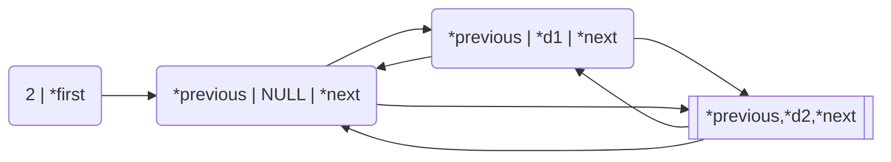

# 1. O que é?

Uma Lista Duplamente Ligada (*DoublyLinkedList*) é uma estrutura de dados alocada **dinamicamente**, cuja navegação ocorre em dois sentidos (**bidirecional**). É uma lista que amplia as capacidades de navegação da [Lista Simplesmente Ligada](http://www.jppreti.com/2019/07/15/lista-simplesmente-ligada/) (*[LinkedList](http://www.jppreti.com/2019/07/15/lista-simplesmente-ligada/)*).

# 2. Biblioteca

Iremos criar uma biblioteca de Lista Duplamente Ligada (`DoublyLinkedList.h`) que basicamente implementa as mesmas operações da nossa [Lista Simplesmente Ligada](http://www.jppreti.com/2019/07/15/lista-simplesmente-ligada/).

As operações complementares criadas nessa biblioteca são:

- `show`: exibe os dados de todos os nós da lista;
- `showMem`: exibe a organização na memória de todos os nós da lista.

Além dessas duas novas operações temos também a definição de um novo ponteiro de função para o algoritmo de impressão que será utilizado pela nossa biblioteca.

typedef void (*printNode)(void*);

Basicamente, o programador que fará uso da biblioteca deverá implementar e passar como parâmetro um procedimento que receba um `void*`.

## 2.1. DoublyLinkedList.h

Segue abaixo a implementação de `DoublyLinkedList.h`:

```c
#ifndef DataStructure_DoublyLinkedList_h
#define DataStructure_DoublyLinkedList_h
#include <stdbool.h>

typedef struct Node {
    void *data;
    struct Node *previous;
    struct Node *next;
}Node;

typedef struct DoublyLinkedList {
    Node *first;
    int size;
}DoublyLinkedList;

typedef bool (*compare)(void*,void*);
typedef void (*printNode)(void*);
void init(DoublyLinkedList *list);
int enqueue(DoublyLinkedList *list, void *data);
void* dequeue(DoublyLinkedList *list);
void* first(DoublyLinkedList *list);
void* last(DoublyLinkedList *list);
int push(DoublyLinkedList *list, void *data);
void* pop(DoublyLinkedList *list);
void* top(DoublyLinkedList *list);
bool isEmpty(DoublyLinkedList *list);
int indexOf(DoublyLinkedList *list,void *data, compare equal);
Node* getNodeByPos(DoublyLinkedList *list,int pos);
void* getPos(DoublyLinkedList *list,int pos);
int add(DoublyLinkedList *list, int pos, void *data);
int addAll(DoublyLinkedList *listDest, int pos, DoublyLinkedList *listSource);
void* removePos(DoublyLinkedList *list, int pos);
bool removeData(DoublyLinkedList *list, void *data, compare equal);
void show(DoublyLinkedList *list, printNode print);
void showMem(DoublyLinkedList *list);

#endif
```

A estrutura em memória deverá se parecer com algo do tipo:



Perceba que, diferentemente da nossa [Lista Simplesmente Ligada](http://www.jppreti.com/2019/07/15/lista-simplesmente-ligada/), essa estrutura é **CIRCULAR**. ou seja, o `previous` do primeiro elemento aponta para o último elemento e o `next` do último elemento aponta para o primeiro elemento.

Outro ponto de observação é que o primeiro elemento (Node) possui `data` igual a `NULL` (0x0). Esse elemento será um **lixo**, ou nó **sentinela**, seu propósito não é guardar nenhum dado, mas simplesmente não deixar que first seja `NULL`.

Essa estratégia de ter um nó lixo ou sentinela tem por objetivo permitir inserções de forma mais rápida, sem se preocupar de ficar testando se a lista está ou não vazia.

## 2.2. DoublyLinkedList.c

Não iremos realizar uma explicação detalhada das operações de `DoublyLinkedList` que já tenham sido implementadas em [LinkedList](http://www.jppreti.com/2019/07/15/lista-simplesmente-ligada/), visto que, as operações são bem similares e podemos ver as diferenças na implementação completa ao final deste post.

#### show

Tem por objetivo exibir todos os dados da lista na ordem em que se encontram na lista.

Primeiro começamos criando uma variável auxiliar (`aux`) que será utilizada para navegar na memória. Começaremos a partir da segundo elemento (`list->first->next`), visto que o primeiro é o nó lixo ou sentinela.

```c
Node *aux = list->first->next;
```

Iremos navegar até o final da lista, ou seja, até nossa variável auxiliar encontrar `first` imprimindo os dados. Perceba que estamos chamando print não da implementação padrão do C e sim do ponteiro de função (função essa implementada pelo usuário da biblioteca).

```c
while (aux!=list->first) {
    print(aux->data);
    aux=aux->next;
}
```

Podemos ver abaixo a implementação completa:

```c
void show(DoublyLinkedList *list, printNode print) {
    Node *aux = list->first->next;
    while (aux!=list->first) {
        print(aux->data);
        aux=aux->next;
    }
}
```

#### showMem

Tem por finalidade exibir a estrutura em memória da nossa lista duplamente ligada.

```c
void showMem(DoublyLinkedList *list) {
    printf("Trash Node: %p\n\n",list->first);
    Node *aux = list->first->next;
    printf("Node Addr : Previous - Data - Next\n\n");
    while (aux!=list->first) {
        printf("%p: %p - %p - %p\n",aux, aux->previous, aux->data, aux->next);
        aux=aux->next;
    }
}
```

A estrutura do resultado deverá ser similar ao apresentado abaixo:


Abaixo podemos ver a implementação completa de `DoublyLinkedList.c`.

```c
#include <stdio.h>
#include <stdlib.h>
#include "DoublyLinkedList.h"

void init(DoublyLinkedList *list) {
    Node *trashNode = (Node*)malloc(sizeof(Node));
    trashNode->data=NULL;
    trashNode->previous=trashNode;
    trashNode->next=trashNode;
    list->first=trashNode;
    list->size=0;
}

int enqueue(DoublyLinkedList *list, void *data) {
    Node *newNode = (Node*)malloc(sizeof(Node));
    if (newNode==NULL) return -1;
    newNode->data = data;
    newNode->next = list->first;
    newNode->previous = list->first->previous;
    list->first->previous->next = newNode;
    list->first->previous = newNode;
    list->size++;
    return 1;
}

void* dequeue(DoublyLinkedList *list) {
    if (isEmpty(list)) return NULL;
    Node *trash = list->first;
    Node *first = list->first->next;
    first->next->previous = trash;
    trash->next = first->next;
    void *data = first->data;
    free(first);
    list->size--;
    return data;
}

void* first(DoublyLinkedList *list) {
    return list->first->next->data;
}

void* last(DoublyLinkedList *list) {
    return list->first->previous->data;
}

int push(DoublyLinkedList *list, void *data) {
    Node *newNode = (Node*) malloc(sizeof(Node));
    if (newNode==NULL) return -1;
    newNode->data = data;
    newNode->next = list->first->next;
    newNode->previous = list->first;
    list->first->next->previous = newNode;
    list->first->next = newNode;
    list->size++;
    return 1;
}

void* pop(DoublyLinkedList *list) {
    return dequeue(list);
}

void* top(DoublyLinkedList *list) {
    return first(list);
}

bool isEmpty(DoublyLinkedList *list) {
    return (list->size==0);
}

int indexOf(DoublyLinkedList *list,void *data,compare equal) {
    if (isEmpty(list)) return -1;
    int count=0;
    Node *aux = list->first->next;
    while(aux!=list->first && !equal(aux->data,data)) {
        aux=aux->next;
        count++;
    }
    return (aux==list->first)?-1:count;
}

Node* getNodeByPos(DoublyLinkedList *list,int pos) {
    if (isEmpty(list) || pos>=list->size) return NULL;
    Node *aux = list->first->next;
    for (int count=0;(aux!=list->first && count<pos);count++,aux=aux->next);
    return aux;
}

void* getPos(DoublyLinkedList *list,int pos) {
    Node *res = getNodeByPos(list,pos);
    return (res==NULL)?NULL:res->data;
}

int add(DoublyLinkedList *list, int pos, void *data) {
    Node *aux = getNodeByPos(list, pos);
    if (aux==NULL) return -2;
    Node *newNode = (Node*) malloc(sizeof(Node));
    if (newNode==NULL) return -1;
    newNode->data = data;
    newNode->next = aux;
    newNode->previous = aux->previous;
    aux->previous->next = newNode;
    aux->previous = newNode;
    list->size++;
    return 1;
}

//REVISAR
int addAll(DoublyLinkedList *listDest, int pos, DoublyLinkedList *listSource) {
Node *aux = getNodeByPos(listDest, pos);
    if (aux==NULL) return -2;
    if (isEmpty(listSource)) return -1;
    listSource->first->previous->next = aux;
    listSource->first->next->previous = aux->previous;
    aux->previous->next = listSource->first->next;
    aux->previous = listSource->first->previous;
    listDest->size+=listSource->size;
    return listSource->size;
}

//REVISAR
void* removePos(DoublyLinkedList *list, int pos) {
    if (isEmpty(list) || pos>=list->size) return NULL;
    Node *nodeRemove = getNodeByPos(list, pos);
    nodeRemove->previous->next = nodeRemove->next;
    nodeRemove->next->previous = nodeRemove->previous;
    void* dataRemove = nodeRemove->data;
    free(nodeRemove);
    list->size--;
    return dataRemove;
}

int removeData(DoublyLinkedList *list, void *data, compare equal) {
    if (isEmpty(list)) return -1;
    Node *nodeRemove = list->first->next;
    while(nodeRemove!=list->first && !equal(nodeRemove->data,data))
        nodeRemove=nodeRemove->next;
    if (nodeRemove!=list->first) {
        nodeRemove->previous->next = nodeRemove->next;
        nodeRemove->next->previous = nodeRemove->previous;
        free(nodeRemove->data);
        free(nodeRemove);
        list->size--;
        return 1;
    } else {
        return 0;
    }
}

void show(DoublyLinkedList *list, printNode print) {
    Node *aux = list->first->next;
    while (aux!=list->first) {
        print(aux->data);
        aux=aux->next;
    }
    printf("\n");
}

void showMem(DoublyLinkedList *list) {
    printf("Trash Node: %p\n\n",list->first);
    Node *aux = list->first->next;
    printf("Node Addr : Previous - Data - Next\n\n");
    while (aux!=list->first) {
        printf("%p: %p - %p - %p\n",aux, aux->previous, aux->data, aux->next);
        aux=aux->next;
    }
}
```

## DoublyLinkedListTest.c

```c
#include <stdlib.h>
#include <stdio.h>
#include "DoublyLinkedList.h"

bool compara(void *data1, void *data2) {
    int *d1 = (int*)data1;
    int *d2 = (int*)data2;
    return (*d1==*d2)?true:false;
}

void impressao(void *data) {
    int *dado = (int*)data;
    printf("%d - ",*dado);
}

int main() {
    DoublyLinkedList list;
    init(&list);

    int *aux = (int *)malloc(sizeof(int));
    *aux=1;
    enqueue(&list, aux);

    aux = (int *)malloc(sizeof(int));
    *aux=2;
    enqueue(&list, aux);

    aux = (int *)malloc(sizeof(int));
    *aux=3;
    enqueue(&list, aux);

    show(&list,impressao);
    showMem(&list);

    printf("%d\n",*((int*)first(&list)));
    printf("%d\n",indexOf(&list,aux,compara));
    printf("%d\n",*((int*)getPos(&list,2)));
    printf("%d\n",*((int*)dequeue(&list)));
    printf("%d\n",*((int*)dequeue(&list)));
    printf("%d\n",*((int*)dequeue(&list)));

    return EXIT_SUCCESS;
}
```
