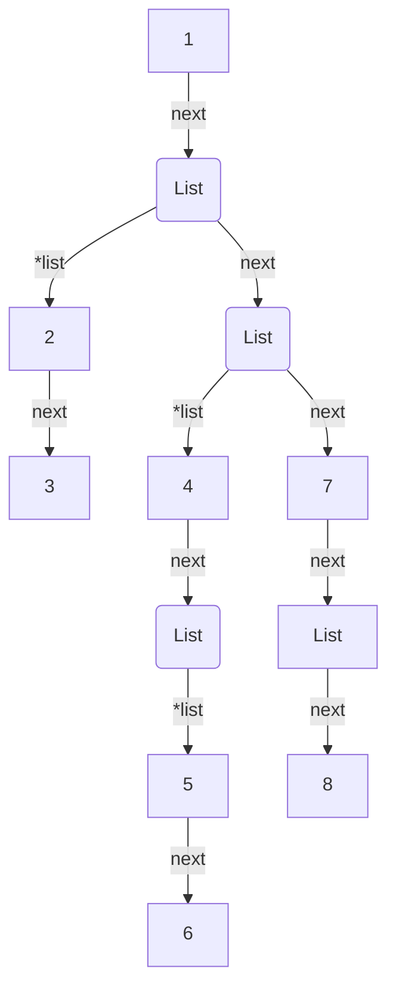

# 1. O que é?

Uma Lista Generalizada (*GeneralizedLinkedList*) é uma estrutura de dados alocada **dinamicamente** que pode ter como elemento um **átomo** (inteiro, real, data, texto, …) ou uma outra **lista**.

Trata-se de uma estrutura recursiva de lista que permite criar estruturas complexas por meio da combinação de listas.

# 2. Pré-requisito

Para que você possa compreender a implementação da biblioteca, faz-se necessário que você saiba como utilizar ponteiros. Veja os artigos abaixo sobre o assunto caso não saiba ou queira relembrar:

- [Ponteiros em C](http://www.jppreti.com/2019/07/15/ponteiros-em-c/);
- [Ponteiro Duplo em C](http://www.jppreti.com/2019/07/15/ponteiro-duplo-em-c/);
- [Lista Simplesmente Ligada](http://www.jppreti.com/2019/07/15/lista-simplesmente-ligada/);
- [Lista Duplamente Ligada](http://www.jppreti.com/2019/07/24/lista-duplamente-ligada/).

# 3. Biblioteca

Uma biblioteca de Lista Generalizada (`GeneralizedLinkedList.h`) deve possuir pelo menos as seguintes operações básicas:

- `addAtom`: adiciona um átomo na lista;
- `addList`: adiciona uma sublista na lista;
- `head`: retorna o primeiro elemento da lista (átomo ou lista);
- `tail`: retorna o resto (uma outra lista, mesmo que vazia).

Operações adicionais:

- `search`: localiza um átomo na lista;
- `depth`: retorna a profundidade da lista;
- `show`: exibe a lista.

## GeneralizedLinkedList.h

Abaixo podemos ver o arquivo `GeneralizedLinkedList.h` proposto:

```c
#ifndef DataStructure_GeneralizedLinkedList_h
#define DataStructure_GeneralizedLinkedList_h
#include <stdbool.h>

typedef struct Node {
    int type; //0 atomo e 1 lista
    union {
        int atom;
        struct Node *list;
    }atomList;
    struct Node *next;
}Node;

int addAtom(Node **list, int atom);
int addList(Node **list, Node **subList);
Node* head(Node *list);
Node* tail(Node *list);
void show(Node *list);
boolean search(Node *list, int atom);
int depth(Node *list);

#endif
```

Uma forma simples de representar uma lista generalizada é por meio do uso dos parênteses (). Por exemplo:

`L = ( 1 , 2 , 3 , 4 , 5 )`

É uma lista com 5 elementos e basicamente igual a uma lista simplesmente ligada. Nessa lista temos como:

`head(L) = 1`

`tail(L) = ( 2 , 3 , 4 , 5 )`

`head(tail(L)) = 2`

Já no exemplo abaixo:

`L = ( ( 1 , 2 ) , ( 3 , 4 ) )`

Temos:

`head(L) = ( 1 , 2 )`

`tail(L) = ( ( 3 , 4 ) )`

`head(tail(L)) = ( 3 , 4 )`

`head(head(tail(L))) = 3`

E por último, o exemplo abaixo:

`L = ( 1 , ( 2 , 3 ) , ( 4 , ( 5 , 6 ) ) , 7 , ( ) , 8 )`

A estrutura em memória deverá se parecer com a seguinte:




Representação Visual da Estrutura de Dados da Lista Generalizada
