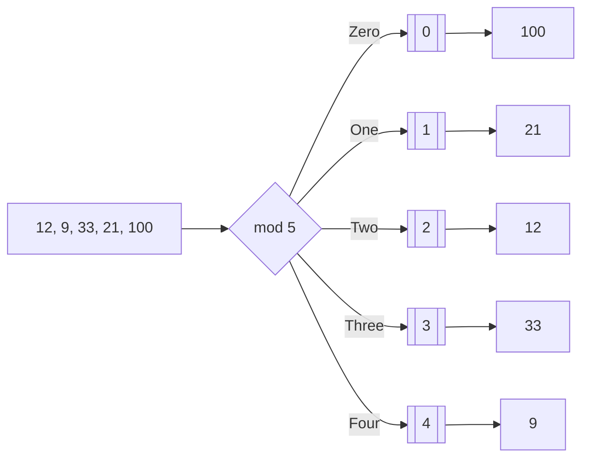
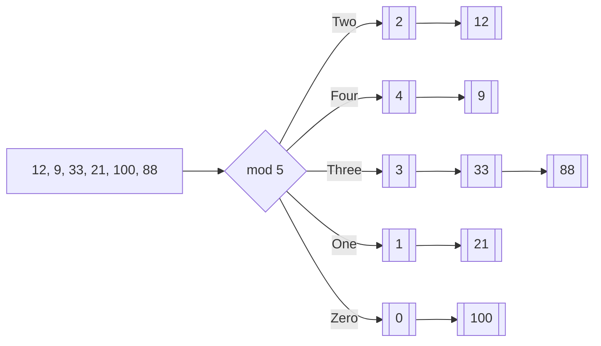

# 1. O que é?

Trata-se de uma estrutura de dados que permite armazenar conjuntos de pares (chave,valor) e que permite realizar operações de busca em tempo esperado **O(1)**.

# 2. Pré-requisito

Para que você possa compreender a implementação da biblioteca, faz-se necessário que você saiba como utilizar ponteiros e listas. Veja os artigos abaixo sobre o assunto caso não saiba ou queira relembrar:

- [Ponteiros em C](http://www.jppreti.com/2019/07/15/ponteiros-em-c/);
- [Ponteiro Duplo em C](http://www.jppreti.com/2019/07/15/ponteiro-duplo-em-c/);
- [Lista Simplesmente Ligada](http://www.jppreti.com/2019/07/15/lista-simplesmente-ligada/);
- [Lista Duplamente Ligada](http://www.jppreti.com/2019/07/24/lista-duplamente-ligada/).

# 3. Contexto

Os algoritmos de busca vistos até agora buscam informações armazenadas com base na comparação de suas chaves.

Vimos que para obtermos algoritmos eficientes, armazenamos os elementos ordenados e tiramos proveito dessa ordenação. Mas mesmo esses algoritmos mais eficientes de busca demandam esforço computacional **O(n)**.

Quando usamos uma tabela hash podemos realizar busca em tempo esperado **O(1)**.

Esse método de pesquisa também pode ser encontrado na literatura por hashing, tabela de dispersão, espalhamento, indexação, escrutínio ou método de cálculo de endereço. Na média dos casos, é possível encontrar a chave com apenas **uma operação de leitura**.

# 4. Como isso funciona?

A ideia é descobrir a posição em que o elemento se encontra sem precisar varrer todas as chaves ou posições. A tabela hash possui essa propriedade, veja a demonstração abaixo:



Perceba que temos um vetor de 5 posições (0-4). Sempre que precisarmos armazenar ou buscar um dado basta aplicar a **função de hash**, que neste exemplo é o resto (`mod`) da divisão por 5 (número de posições).

Perceba que para sabermos aonde está localizado o número 9 não precisamos percorrer o vetor, basta realizar o cálculo de hash (9 mod 5) para descobrir a posição (4).

Perceba também que apesar de simples, essa função mapeia dados de comprimento variável para dados de comprimento fixo. Independente do tamanho do número, o resultado sempre será um valor entre 0 e 4.

## 4.1. Conclusão

A utilização de hashing envolve:

- computar a função de transformação;
- tratar colisões.

### 4.1.1. Computar a Função de Transformação

Uma função hash deve:

- mapear chaves em inteiros entre 0 e N-1, onde N é o tamanho da tabela;
- ser de computação simples;
- gerar entradas para a tabela com igual probabilidade.

### 4.1.2. Tratar Colisões

A tabela de hash tem tamanho finito e o conjunto de dados de entrada pode ser “infinito”, como consequência teremos colisões (duas ou mais entradas com o mesmo código de hash) e devemos tratar isso.

Uma forma de tratamento é a utilização de vetores para a tabela de hash e cada posição do vetor ser um ponteiro de uma lista encadeada. Veja figura abaixo:



Tabela Hash utilizando Lista Simplesmente Ligada para as colisões

# 5. Biblioteca

Iremos criar uma biblioteca de Hash (`Hash.h`) que possua as seguintes operações:

- `isHashEmpty`: verifica se a tabela de hash está vazia;
- `hash`: calcula o hash para a chave;
- `put`: insere um par (chave,valor);
- `containsKey`: verifica se a chave já existe na tabela de hash;
- `get`: retorna o valor buscando pela chave;
- `removeKey`: remove um par (chave,valor);
- `showHashStruct`: exibe os pares armazenados.

## 5.1. Hash.h

```c
#ifndef EstruturaDeDados_Hash_h
#define EstruturaDeDados_Hash_h
#include "DoublyLinkedList.h"
#define MAX 10

typedef struct HashStruct {
    DoublyLinkedList hashes[MAX];
    int size;
}HashStruct;

void initHash(HashStruct *hashStruct);
bool isHashEmpty(HashStruct *hashStruct);
int hash(char *key);
int put(HashStruct *hashStruct, char *key, void *data, compare equal);
bool containsKey(HashStruct *hashStruct, char *key, compare equal);
void* get(HashStruct *hashStruct, char *key, compare equal);
void* removeKey(HashStruct *hashStruct, char *key, compare equal);
void showHashStruct(HashStruct *hashStruct);

#endif
```

Veja que vamos utilizar nossa implementação de [DoublyLinkedList](http://www.jppreti.com/2019/07/24/lista-duplamente-ligada/) para tratar as colisões.

## 5.2. Hash.c

#### initHash

Nesta função de inicialização iremos percorrer cada posição de nossa tabela de hash inicializando a lista duplamente ligada de cada posição.

```c
void initHash(HashStruct *hashStruct) {
    for (int i=0;i<MAX;i++) {
        //chamando init de DoublyLinkedList para inicializar cada lista do vetor
        init(&(hashStruct->hashes[i]));
    }
    hashStruct->size = 0;
}
```

#### hash

A função hash por sua vez, recebe uma chave e calcula qual a posição que deveremos inserir o dado associado a essa chave.

Essa chave pode ser o nome de um cliente, o número de matrícula de um aluno, um código de barras de um produto. Normalmente escolhemos uma chave que seja um dado único.

```c
int hash(char *key) {
    int sum = 0;
    // percorremos todos os caracteres da string passada
    for (int i = 0; key[i]!=0;i++) {
    //acumulamos os códigos ascii de cada letra com um peso
        sum+=key[i]*(i+1);
    }
    return sum%MAX; //retorna o resto da divisão
}
```

Perceba que multiplicamos o código ascii do caractere por um peso baseado em sua posição (`i+1`):

`sum += key[i] * (i+1);`

Caso contrário a palavra ALO e a palavra OLA teriam o mesmo código de hash.

#### containsKey

O objetivo aqui é verificar se a chave já existe na tabela de hash.

Para isso precisamos primeiro descobrir em qual das diversas listas está a nossa chave (se é que está lá).

`int hashValue = hash(key);`

Agora podemos utilizar a função `indexOf` de nossa [DoublyLinkedList](http://www.jppreti.com/2019/07/24/lista-duplamente-ligada/) para saber em que posição da lista está a nossa chave:

`int pos = indexOf(&hashStruct->hashes[hashValue], key, equal);`

Se `indexOf` retornar `-1` é porque a chave não se encontra na lista, não existindo em nossa tabela de hash:

`return (pos!=-1)?true:false;`

Segue abaixo implementação completa `containsKey`:

```c
bool containsKey(HashStruct *hashStruct, char *key, compare equal) {
    //calcula a posição
    int hashValue = hash(key);
    //busca na fila a posição da chave
    int pos = indexOf(&hashStruct->hashes[hashValue], key, equal);
    return (pos!=-1)?true:false;
}
```

#### put

Agora podemos inserir dados em nossa tabela de hash. Para isso precisamos verificar se a chave já se encontra em nossa tabela para que não haja redundância:

`if (!containsKey(hashStruct, key)`

Se a chave ainda não foi inserida então podemos chamar a função `enqueue` de [DoublyLinkedList](http://www.jppreti.com/2019/07/24/lista-duplamente-ligada/) para a lista que se encontra na posição calculada pelo `hash`.

`int res = enqueue(&hashStruct->hashes[hash(key)],data);`

Incrementamos o `size` pela quantidade de dados inseridos por `enqueue`, neste caso apenas `1`.

`hashStruct->size+=res;`

Abaixo podemos ver a implementação completa de `put`:

```c
int put(HashStruct *hashStruct, char *key, void *data, compare equal) {
    if (!containsKey(hashStruct, key, equal) {
        //adiciona na fila que está na posição devolvida pela função hash
        int res = enqueue(&hashStruct->hashes[hash(key)],data);
        //incrementa a qtde de elementos baseado na quantidade inserida por enqueue
        hashStruct->size+=res;
        return res;
    }
    return 0;
}
```

#### get

Agora podemos realizar buscas em nossa estrutura. Como de costume precisamos descobrir em que lista o nosso dado de interesse se encontra (possivelmente):

`int hashValue = hash(key);`

Partimos então para começar a nossa busca a partir do segundo nó (`hashStruct->hashes[hashValue].first->next`), visto que o primeiro nó é o sentinela de acordo com nossa implementação de [DoublyLinkedList](http://www.jppreti.com/2019/07/24/lista-duplamente-ligada/).

Normalmente em casos que não há colisão (`size==1`) basta retornar o primeiro elemento (`first`), mas não precisamos nos preocupar com isso já que nossa lista é circular:

`while(aux!=hashStruct->hashes[hashValue].first && !equal(aux->data, key))`

`    aux=aux->next;`

Mesmo que nossa lista não tenha elementos, o nó sentinela garante que não iremos nos deparar com `NULL` e caso nosso auxiliar (`aux`) navegue por toda a lista e chegue novamente ao nó sentinela (o que encerra o laço while) o retorno será o `data` de sentinela que é `NULL`, indicando que o dado não foi encontrado.

Segue abaixo a implementação completa de `get`:

```c
void* get(HashStruct *hashStruct, char *key, compare equal) {
    // descobre em qual fila/lista está o dado
    int hashValue = hash(key);
    //first é nó sentinela, começamos do segundo nó
    Node *aux = hashStruct->hashes[hashValue].first->next;
    // procuramos o dado na lista
    while(aux!=hashStruct->hashes[hashValue].first && !equal(aux->data, key))
        aux=aux->next;
    return aux->data;
}
```

#### removeKey

```c
void* removeKey(HashStruct *hashStruct, char *key, compare equal) {
    int hashValue = hash(key);
    int pos = indexOf(&hashStruct->hashes[hashValue], key, equal);
    void* result = removePos(&hashStruct->hashes[hashValue], pos);
    if (result!=NULL) hashStruct->size--;
        return result;
}
```

#### showHashStruct

```c
void showHashStruct(HashStruct *hashStruct, printNode print) {
    printf("There are %d elements in the Hash\n\n",hashStruct->size);
    for (int i=0; i < MAX; i++) {
        printf("Hash %d has %d elements: ",i,hashStruct->hashes[i].size);
        show(&hashStruct->hashes[i],print);
        printf("\n");
    }
}
```

Abaixo podemos ver a implementação completa de `Hash.c`:

```c
#include <stdio.h>
#include <stdlib.h>
#include <string.h>
#include "Hash.h"

void initHash(HashStruct *hashStruct) {
    for (int i=0;i<MAX;i++) {
    //chamando init de DoublyLinkedList para inicializar cada lista do vetor
        init(&(hashStruct->hashes[i]));
    }
    hashStruct->size = 0;
}

bool isHashEmpty(HashStruct *hashStruct) {
    return hashStruct->size==0;
}

int hash(char *key) {
    int sum = 0;
    // percorremos todos os caracteres da string passada
    for (int i = 0; key[i]!=0;i++) {
        //acumulamos os códigos ascii de cada letra com um peso
        sum+=key[i]*(i+1);
    }
    return sum%MAX; //retorna o resto da divisão
}

int put(HashStruct *hashStruct, char *key, void *data, compare equal) {
    if (!containsKey(hashStruct, key, equal) {
        //adiciona na fila que está na posição devolvida pela função hash
        int res = enqueue(&hashStruct->hashes[hash(key)],data);
        //incrementa a qtde de elementos baseado na quantidade inserida por enqueue
        hashStruct->size+=res;
        return res;
    }
    return 0;
}

bool containsKey(HashStruct *hashStruct, char *key, compare equal) {
    //calcula a posição
    int hashValue = hash(key);
    //busca na fila a posição da chave
    int pos = indexOf(&hashStruct->hashes[hashValue], key, equal);
    return (pos!=-1)?true:false;
}

void* get(HashStruct *hashStruct, char *key, compare equal) {
    // descobre em qual fila/lista está o dado
    int hashValue = hash(key);
    //first é nó sentinela, começamos do segundo nó
    Node *aux = hashStruct->hashes[hashValue].first->next;
    // procuramos o dado na lista
    while(aux!=hashStruct->hashes[hashValue].first && !equal(aux->data, key))
        aux=aux->next;
    return aux->data;
}

void* removeKey(HashStruct *hashStruct, char *key, compare equal) {
    int hashValue = hash(key);
    int pos = indexOf(&hashStruct->hashes[hashValue], key, equal);
    void* result = removePos(&hashStruct->hashes[hashValue], pos);
    if (result!=NULL) hashStruct->size--;
    return result;
}

void showHashStruct(HashStruct *hashStruct, printNode print) {
    printf("There are %d elements in the Hash\n\n",hashStruct->size);
    for (int i=0; i < MAX; i++) {
        printf("Hash %d has %d elements: ",i,hashStruct->hashes[i].size);
        show(&hashStruct->hashes[i],print);
        printf("\n");
    }
}
```

## HashTest.c

```c
#include <stdio.h>
#include <stdlib.h>
#include <string.h>
#include "Hash.h"

typedef struct Cliente {
    char nome[50];
    char email[50];
}Cliente;

bool comparaChaves(void *key, void *data) {
    char *chave = (char*)key;
    Cliente *c = (Cliente*)data;
    return (strcmp (chave, c->email) == 0)?true:false;
}

void printCliente(void *data) {
    Cliente *cliente = (Cliente*)data;
    printf("{%s,%s} - ", cliente->nome, cliente->email);
}

int main() {
    HashStruct hashes;
    initHash(&hashes);
    printf("%d\n",hash("joao.preti@cba.ifmt.edu.br"));
    Cliente *c = (Cliente *)malloc(sizeof(Cliente));
    strcpy(c->nome,"Joao Paulo") ;
    strcpy(c->email,"joao.preti@cba.ifmt.edu.br");
    printf("%d\n",hash(c->email));
    put(&hashes, c->email, c, comparaChaves);
    printf("%d\n",hashes.hashes[hash("joao.preti@cba.ifmt.edu.br")].size);
    printf("%d\n",hashes.size);
    printf("%d\n",containsKey(&hashes, "joao.preti@cba.ifmt.edu.br", comparaChaves));
    Cliente *cliente = (Cliente*)get(&hashes, "joao.preti@cba.ifmt.edu.br", comparaChaves);
    printf("%s\n",cliente->nome);
    c = (Cliente *)malloc(sizeof(Cliente));
    strcpy(c->nome,"Maria") ;
    strcpy(c->email,"maria@email.br");
    put(&hashes, c->email, c, comparaChaves);
    c = (Cliente *)malloc(sizeof(Cliente));
    strcpy(c->nome,"Pedro") ;
    strcpy(c->email,"pedro@email.com.br");
    put(&hashes, c->email, c, comparaChaves);
    c = (Cliente *)malloc(sizeof(Cliente));
    strcpy(c->nome,"Carla") ;
    strcpy(c->email,"carla@gmail.com.br");
    put(&hashes, c->email, c, comparaChaves);
    showHashStruct(&hashes, printCliente);
    return 0;
}
```
