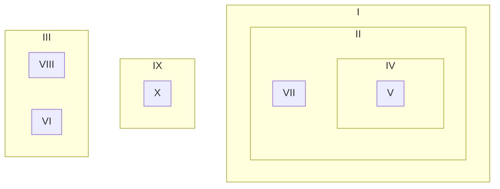
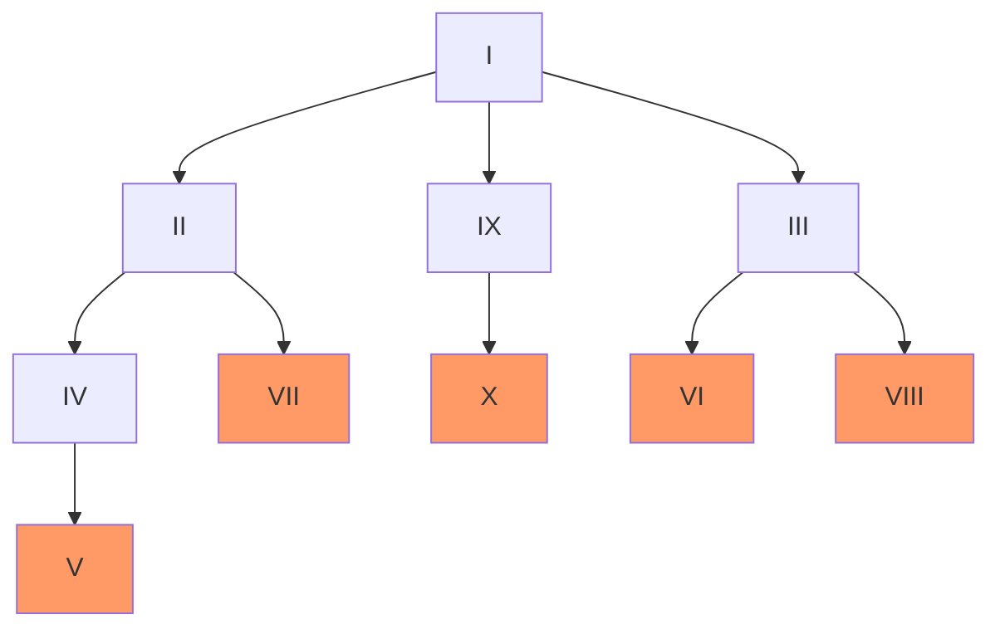
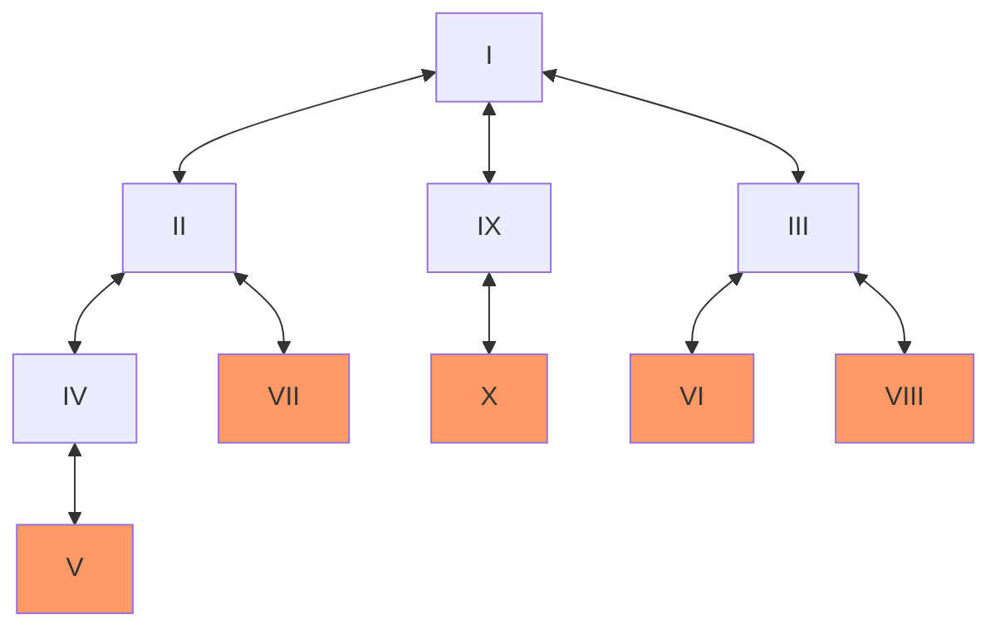
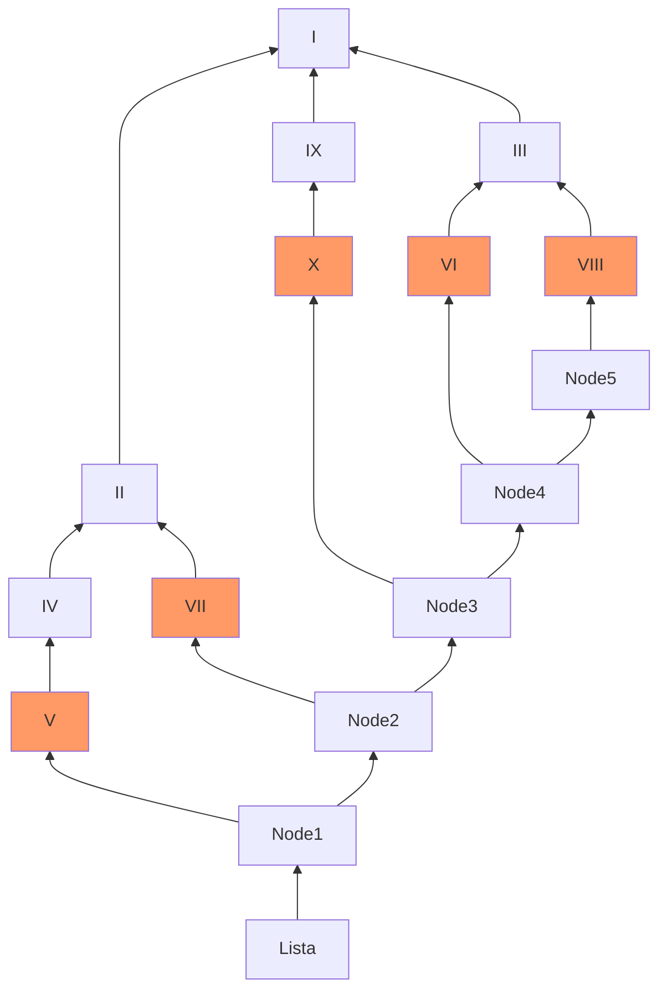
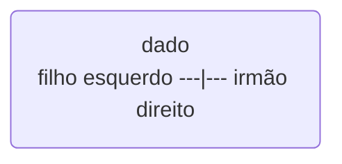

# 1. O que é?

É uma estrutura de dados que organiza os dados de forma **hierárquica**.

Os nós de uma árvore possuem **0 ou mais filhos**, mas possuem **um único nó pai**.

# 2. Representações Válidas

Todas as representações abaixo são equivalentes e válidas de acordo com o conceito de árvore:

Exemplo de representação por tabulação (..) e prioridade (parênteses):

```textile
I
..II
....IV
......V
....VII
..IX
....X
..III
....VI
....VIII
```

```textile
( I ( II ( IV ( V ) VII ) IX ( X ) III ( VI VIII ) )
```

Representação na forma de conjunto:




Representação Convencional

# 3. Definições

Uma **árvore** é composta por um **nó raiz** e suas **subárvores**, sendo que cada nó guarda um dado e suas ramificações.

Nó raiz e suas subárvores

O **grau de um nó** é o número de subárvores do nó:

- Grau de I = 3;
- Grau de IX = 1;
- Grau de III = 2;
- Grau de VII = 0;

Se o grau é igual a 0 (zero) o nó é chamado de **folha** ou **terminal** {V , VII , X , VI , VIII}. Já se o grau do nó é maior do que zero dizemos que ele é **não-terminal** {I , II , IV , IX , III}.

Já o **grau da árvore** é igual ao maior grau encontrado em seus nós. No caso do exemplo é igual a 3.

Chamamos de **nós filhos** de I os nós que são raízes das subárvores de I {II , IX , III}. I é o **nó pai** de {II , IX , III} que são **irmãos** por terem o mesmo nó pai.

Chamamos também de **nós ancestrais** os nós no caminho da raiz até um determinado nó. Os nós ancestrais de V são {I , II , IV}.

A árvore possuí níveis, sendo que o nó raiz tem **nível** 0 e seus filhos tem nível n+1.



A **altura** ou a **profundidade** da árvore é igual ao maior nível dentre todos os nós, neste exemplo é igual a 3 (h=3).

As figuras tem apresentado a **representação convencional** de uma árvore, aonde **cada nó aponta para seus filhos**, ou seja, podemos somente navegar descendo na árvore partindo do nó raiz.

Mas encontramos representações aonde um **ponteiro adicional** permite verificar quem é o pai do nó em questão, permitindo assim subir ou descer pela árvore. Exemplo de árvore bidirecional:



Também podemos encontrar uma representação **invertida**, onde temos apenas um ponteiro em cada nó e os filhos apontam para o pai. Essa representação precisa de um conjunto de apontadores para todos os nós folhas. Exemplo de árvore invertida:



É possível também representar uma árvore de grau > 2 por meio de uma árvore binária. Neste caso, cada nó possui a seguinte estrutura:



Estrutura do Nó para uma Árvore Binária de Grau > 2

Dessa forma podemos representar a mesma árvore da seguinte forma:


Árvore Binária para representação de Grau > 2

Tratamos aqui do conceito geral de árvore, mas veremos que existem muitos tipos de árvores como: ABB, AVL, Rubro-Negra, B+,… Assuntos para os próximos posts.
