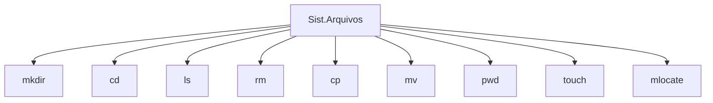
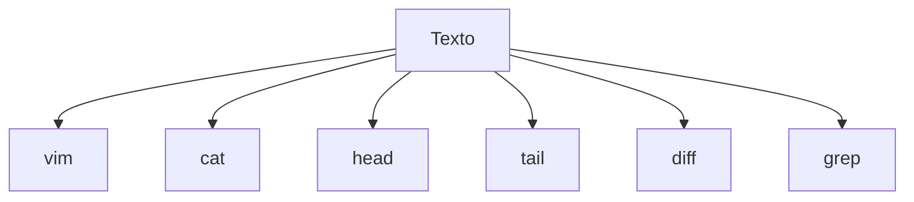
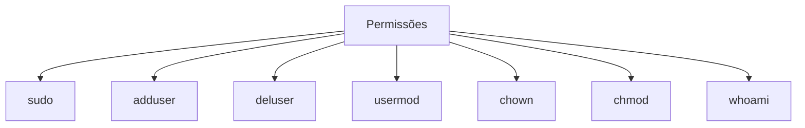
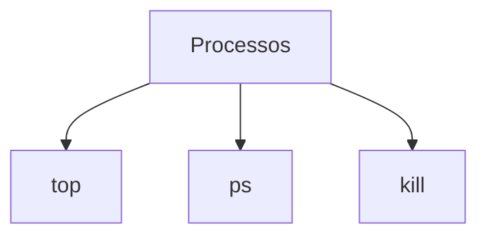
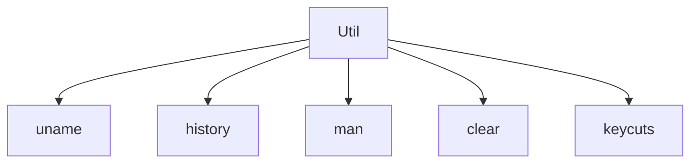

# 1. Comandos Básicos em Linux


## Sistema de Arquivos



### ls

Lista o conteúdo de um diretório

`ls`

A saída padrão do comando ls exibe apenas o nome dos arquivos e diretórios. Utilize a opção `-l` para o formato longo:

```shell
ls -l 
```

O comando ls não lista os arquivos ocultospor padrão. Um arquivo oculto é qualquer arquivo que comece com (`.`). Para exibir os arquivos ocultos utilize a opção `-a`:

```shell
ls -a
```

### pwd

Exibe o caminho do diretório atual.

```shell
pwd
```

### cd

Muda de diretório.

Quando utilizado sem argumentos irá posicioná-lo em seu diretório `home`:

```shell
cd
```

Pode utilizar caminhos relativos ou absolutos para mudar de diretório:

Segue exemplo de navegação para o diretório `Downloads`, neste caso o usuário logado é o jppreti:

```shell
cd /Users/jppreti/Downloads
```

Se já está posicionado no diretório `/Users/jppreti` basta executar: 

```shell
cd Download
```

Para voltar ao diretório anterior:

```shell
cd ../
```

Para subir mais dois níveis:

```shell
cd ../../
```

Para voltar ao diretório anterior utilize o traço (-) como argumento:

```shell
cd -
```

### mkdir

Cria um diretório vazio.

Criando um novo diretório dentro do diretório atual:

```shell
mkdir novo_diretorio
```

### touch

Cria um arquivo em branco.

```shell
touch arquivo.txt
```

### rm

Exclui arquivos e diretórios.

Removendo um arquivo:

```shell
rm arquivo.txt
```

Removendo um diretório vazio:

```shell
rm -d diretorio
```

Para remover um diretório que não está vazio e apagar todo seu conteúdo de forma recursiva, utilize o argumento `-r`:

```shell
rm -rf diretorio
```

### cp

Permite copiar arquivos e diretórios:

Para criar uma cópia do arquivo dentro do mesmo diretório basta utilizar o nome do arquivo de origem e outro nome para o novo arquivo:

```shell
cp arquivo.txt novo_arquivo.txt
```

Para copiar um arquivo para outro diretório faz-se necessário especificar o caminho relativo ou absoluto do diretório de destino. Se especificar apenas o caminho do diretório de destino então a cópia terá o mesmo nome do arquivo original.

```shell
cp arquivo.txt /Users/jppreti/Downloads
```

Por padrão se o arquivo já existir no destino ele será sobrescrito.

Para copiar um diretório incluindo todos os arquivos e subdiretórios dentro dele, utilize a opção `-r`:

```shell
cp -r fotos /Users/jppreti/Desktop
```

### mv

Comando utilizado para renomear ou mover arquivos e diretórios de um local para outro.

Por exemplo, movendo um arquivo para outro diretório:

```shell
mv arquivo.txt /Desktop
```

Para renomear um arquivo é necessário especificar o nome do arquivo no destino:

```shell
mv arquivo.txt novo_nome.txt
```

Para mover varios arquivos e diretorios, especifique o diretório de destino ao final:

```shell
mv arquivo1.txt arquivo2.txt /Desktop
```

### mlocate

Você pode o comando mlocate para localizar um arquivo. A opção `-i` faz com que ele ignore a diferença entre maiúsculas e minúsculas.

Para procurar um arquivo que contém duas ou mais palavras, use um asterisco `*`. Por exemplo:

```shell
mlocate -i laboratorio*programacao
```

Encontra qualquer arquivo que tenha as palavras `laboratorio` e `programacao`, não importando se as letras são maiúsculas ou minúsculas.

## Texto



### cat

Exibe o conteúdo de um arquivo.

```shell
cat /Users/jppreti/Downloads/abc.txt
```

### vim

Editor de texto de terminal.

```shell
vim arquivo.txt
```

### head

O comando head é usado para ver as primeiras linhas de um arquivo de texto. Por padrão, ele vai mostrar as primeiras 10 linhas, mas você pode mudar essa quantidade utilizando a opção `-n`: 

```shell
head -n 5 arquivo.txt.
```

### tail

O comando tail tem função similar ao comando head, mas mostra as últimas linhas de um arquivo.

```shell
tail -n 5 arquivo.txt
```

### diff

O comando diff (diferença) compara o conteúdo de dois arquivos linha por linha.

```shell
diff arquivo1.txt arquivo2.txt
```

### grep

Permite que você procure dentro de um arquivo específico. Por exemplo:

```shell
grep chown comandosbasicos.txt
```

Procura pela palavra chwon no arquivo comandosbasicos.txt. Linhas que contêm a palavra pesquisada serão mostradas por completo.

## Permissões



### sudo

Eleva os privilégios do usuário.

O comando `sudo` permite executar comandos como outro usuário, por padrão é o usuário `root`.

Alguns exemplos:

```shell
sudo apt update
sudo apt upgrade 
sudo apt install ansible -y
sudo cat /temp/
```

### usermod

Adiciona usuários a grupos.

Para adicionar um usuário para um grupo utilize o argumento -G seguido do nome do grupo:

```shell
usermod -a -G Docker Jenkins
```

### chmod

Muda as permissões de leitura (+r), escrita (+w) e execução (+x) de um arquivo ou diretório. Por exemplo:

```shell
chmod +x arquivo.sh
```

Torna o arquivo.sh passível de execução.

### chown

No Linux, todos os arquivos são de propriedade de um usuário específico. O comando chown permite que você mude ou transfira a propriedade de um arquivo para um usuário específico. O exemplo abaixo transfere a propriedade de um arquivo para o usuário jppreti.

```shell
chown jppreti arquivo.txt
```

### whoami

Comando que exibe qual é o usuário logado.

## Disco


### df

Informa o uso do disco pelo sistema em KBs. Use a opção `-m` para visualizar em MBs.

```shell
df -m
```

### du

Informa o quanto de espaço um arquivo ou diretório está ocupando no disco. Utilize a opção `-h` (human readable) para exibir em KBs, MBs, etc.

```shell
du -h
```

## Processos



### top

Exibe os processos atuais que estão consumindo a maioria dos recursos da máquina. Por exemplo:

```shell
top -u jppreti
```

Exibe os processos em execução do usuário jppreti. Ao pressionar a letra `K` pode-se informar o número do processo (PID) que deseja encerrar.

### kill

Se você tem um programa que não está respondendo bem, você pode finalizá-lo manualmente pelo comando `kill`. Ele vai mandar um sinal ao aplicativo com mau funcionamento e instruir que este seja encerrado.

É preciso conhecer o número de identificação do processo (PID) do programa que você deseja encerrar, que pode ser obtido pelo comando `top` ou pelo comando `ps ux`.  

```shell
kill 1234
```

Encerra o processo de código 1234.

## Rede


### ping

Verifica o status da conexão de um dispositivo na rede. Por exemplo:

```shell
ping google.com
```

Checa se o Google está acessível e também mede o tempo de resposta.

### wget

Permite baixar arquivos da internet, simplesmente digite `wget` seguido pelo link de download do arquivo.

### ssh

Conectando a uma instância EC2 via terminal:

```shell
ssh -i file.pem username@ip-address
```

`-i`: Espeficica uma forma de identificação alternativa por meio de arquivo com achave pública.
username: nome de usuário para login `ip-address`: endereço da instância EC2

Outras comandos SSH importantes que vão além do cliente SSH.

`ssh-keygen` — criar um par de chaves para autenticação por chave pública `ssh-copy-id` — configura uma chave pública como autorizada em um servidor `ssh-agent` — agente para manter a chave privada para single sign-on `ssh-add` — ferramenta para adicionar uma chave ao agente `scp` — cliente para transferência de arquivo no estilo de linha de comando RCP `sftp` — cliente para transferência de arquivo no estilo de linha de comando FTP `sshd` — servidor OpenSSH

### hostname

Informa qual seu host/network (da sua rede), se adicionar -I ao final, exibirá o endereço IP da sua rede.

```shell
hostname -I
```

### ifconfig

Comando que exibe detalhes sobre as interfaces de rede e suas configurações da sua máquina.

## Utilitários



### uname

Significa Unix Name, mostra informações detalhadas sobre seu sistema Linux. Isso inclui o nome da máquina, do sistema operacional, do kernel, etc.

```shell
uname -a
```

### history

Comando que permite rever o histórico de comandos que você já exxecutou no linux.

### man

Está em dúvida sobre como usar um comando, use `man` (manual) para obter ajuda, por exemplo:

```shell
man tail
```

Apresenta ajuda sobre como utilizar o comando `tail`.

### Dicas

O comando `clear` limpa o terminal, útil quando a tela estiver cheia de muitos comandos utilizados anteriormente. 

Experimente a tecla TAB para preencher automaticamente o que você está digitando. Por exemplo, se você precisa digitar Downloads, comece a digitar o comando (vamos usar o cd Dow, então aperte a tecla TAB) e o terminal preencherá o restante..

`Ctrl + C` e `Ctrl + Z` são usados para qualquer comando que esteja em execução. `Ctrl + C` interromperá o comando com segurança, e `Ctrl + Z` interrompe de forma abrupta.

Caso o terminal trave acidentalmente com o `Ctrl + S`, simplesmente desfaça o congelamento com `Ctrl + Z` ou `CTRL + C`.

`Ctrl + A` move o cursor para o início da linha enquanto `Ctrl + E` move o cursor para o final.

Você pode executar vários comandos em um único comando usando o `;` Use o comando clear para limpar o terminal se estiver cheio de muitos comandos usados anteriormente. 

Experimente o botão TAB para preencher automaticamente o que você está digitando. Por exemplo, se você precisa digitar Documentos, comece a digitar o comando (vamos usar o cd Docu, então aperte a tecla TAB) e o terminal preencherá o restante, mostrando o cd Documents.

Ctrl + C e Ctrl + Z são usados para qualquer comando que esteja funcionando no momento. Ctrl + C interromperá o comando com segurança, e o Ctrl + Z forçara a parada.

Se você congelar seu terminal acidentalmente com o Ctrl + S, simplesmente desfaça o congelamento com Ctrl + Z.

Ctrl + A move você para o início da linha enquanto Ctrl + E move você para o fim.

Você pode executar vários comandos em um único comando usando o `;` para separá-los. Por exemplo:

```shell
ls ; pwd ; whoami
```

Ou use `&&` se desejar que o próximo comando seja executado apenas quando o primeiro comando indicado estiver funcionando.

Use o caractere pipe `|` para fazer com que a saída de um comando possa ser utilizada como entrada de outro. Por exemplo:

```shell
du -h | head -n 10
```

Lista apenas as 10 primeiras linhas do resultado do comando `du`.
